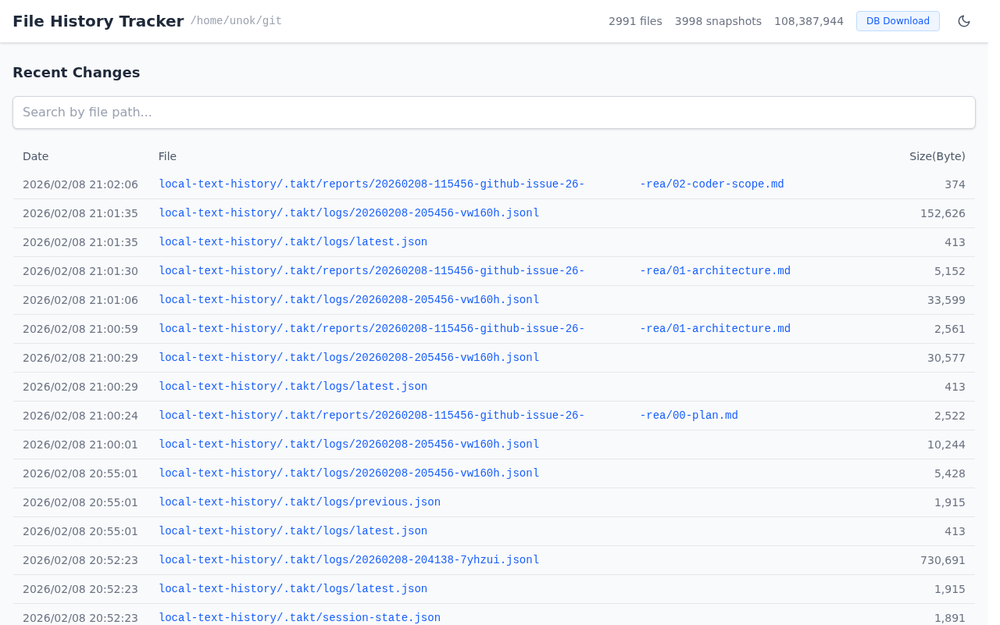

# File History Tracker

JetBrains Local History 相当のファイル履歴追跡ツール。指定ディレクトリ内のテキストファイルの変更をリアルタイムに検知し、スナップショットとして SQLite に保存します。Web UI で履歴の検索・差分表示・ファイル復元が可能な単一バイナリです。

## 主な機能

- **ファイル監視**: fsnotify によるリアルタイム変更検知（新規ディレクトリも自動監視）
- **スナップショット保存**: zstd 圧縮 + SHA-256 による重複スキップ（SQLite WAL モード）
- **リネーム追跡**: ファイル名変更を自動検知し、リネーム履歴を記録
- **バイナリファイル自動除外**: NUL バイト方式で自動判定し、バイナリファイルは監視対象から除外
- **Web UI**: 履歴フィード、パス検索、スナップショットタイムライン、差分表示（side-by-side / inline）
- **SSE リアルタイム通知**: Server-Sent Events で変更をブラウザにプッシュ
- **データベースダウンロード**: Web UI から DB のスナップショットをダウンロード可能
- **Basic 認証**: オプションで HTTP Basic 認証を有効化
- **単一バイナリ**: Go embed で React SPA を同梱。デプロイはバイナリ1つのみ

## 必要環境

- Go 1.25+（CGO 有効）
- Node.js 20+
- GCC（sqlite3 ビルド用）

## クイックスタート

### ビルド

```bash
make build
```

生成バイナリ: `bin/file-history`

### 設定ファイルの作成

```bash
mkdir -p ~/.config/file-history
cp config.example.json ~/.config/file-history/config.json
```

`watchDirs` を監視したいディレクトリに変更してください。

### 起動

```bash
./bin/file-history --config ~/.config/file-history/config.json
```

ブラウザで `http://localhost:9876` を開きます。

### systemd で自動起動（ユーザーモード）

```bash
cp bin/file-history ~/.local/bin/
cp file-history.service ~/.config/systemd/user/
systemctl --user enable --now file-history
```

systemd ユニットファイルはホームディレクトリ（`%h`）内のパスを参照します:
- バイナリ: `~/.local/bin/file-history`
- 設定: `~/.config/file-history/config.json`

## 設定リファレンス

| 項目 | 型 | デフォルト | 説明 |
|------|------|-----------|------|
| `watchDirs` | `string[]` | （必須） | 監視するディレクトリ |
| `debounceSec` | `int` | `2` | デバウンス秒数（ファイルごと独立） |
| `bindAddress` | `string` | `0.0.0.0` | HTTP サーバーのバインドアドレス |
| `port` | `int` | `9876` | HTTP サーバーポート |
| `dbPath` | `string` | `~/.local/share/file-history/history.db` | SQLite データベースパス |
| `extensions` | `string[]` | （未指定） | 監視対象の拡張子。未指定時はバイナリ判定のみで全テキストファイルを監視 |
| `excludePatterns` | `string[]` | （下記参照） | 除外パターン（`**` 対応） |
| `maxFileSize` | `int` | `1048576` | 最大ファイルサイズ（バイト） |
| `maxSnapshots` | `int` | `0` | ファイルあたり最大スナップショット数（0=無制限） |
| `basicAuth` | `object` | （未指定） | Basic 認証の設定。`username` と `password` を指定 |

### basicAuth の設定例

```json
{
  "basicAuth": {
    "username": "admin",
    "password": "your-password"
  }
}
```

`basicAuth` を指定しない場合、認証なしで動作します。

### excludePatterns のデフォルト値

`excludePatterns` 未指定時は以下が自動適用されます:

`**/node_modules/**`, `**/.git/**`, `**/vendor/**`, `**/dist/**`, `**/build/**`, `**/.next/**`, `**/__pycache__/**`, `**/target/**`, `**/*.min.js`, `**/*.min.css`, `**/*.lock`, `**/package-lock.json`, `**/pnpm-lock.yaml`

## スクリーンショット

### ダッシュボード

直近の変更履歴をフィード形式で表示。パス検索・ページネーション対応。



### 差分表示

スナップショット間の差分を side-by-side / inline で表示。シンタックスハイライト付き。


## Web UI の使い方

### ダッシュボード

トップページには直近の変更履歴がフィード形式で表示されます。パス検索バーでファイルパスの部分一致検索が可能です。リネームイベントも履歴に表示されます。

### ファイル詳細・スナップショット比較

ファイルを選択するとスナップショットのタイムラインが表示されます。2つのスナップショットを選んで差分を表示できます（side-by-side / inline 切替）。各スナップショットのダウンロードも可能です。リネーム履歴がある場合はそちらも表示されます。

### データベースダウンロード

ヘッダーのダウンロードボタンから、データベース全体のスナップショットを SQLite ファイルとしてダウンロードできます。バックアップや別マシンへの移行に使用できます。

## 開発

```bash
# Web UI 開発サーバー（Vite proxy で Go サーバーに転送）
cd web && npm run dev

# Go サーバー起動（別ターミナル）
go run ./cmd/file-history --config config.example.json

# テスト実行
make test          # Go テスト
cd web && npm test # Web テスト
```

- 内部構造: [ARCHITECTURE.md](ARCHITECTURE.md)
- API リファレンス: [docs/API.md](docs/API.md)

## ライセンス

MIT
